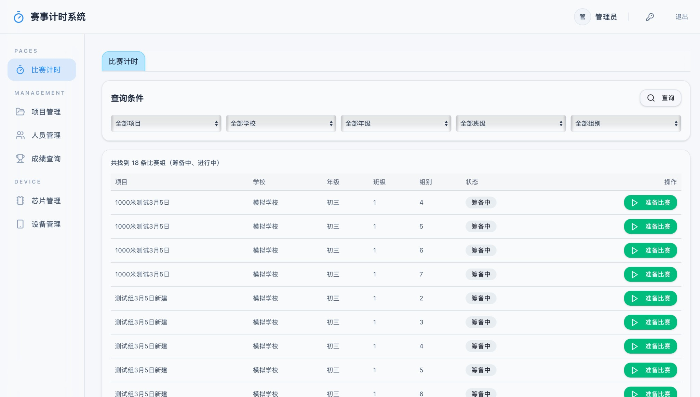
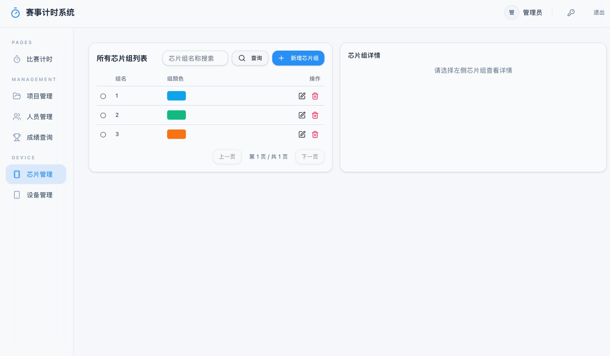

# claude-web-console

<p align="center">
  一个基于 Python Agent SDK 的 Claude Code Web 控制台。
</p>

<p align="center">
  <a href="https://www.python.org/"></a>
  <a href="https://fastapi.tiangolo.com/"></a>
  <a href="https://docs.anthropic.com/en/docs/claude-code/overview"></a>
  
</p>

`claude-web-console` 把本机 `Claude Code` 的多轮会话能力封装成一个本地 Web 应用，提供更友好的浏览器交互层，并保留 Claude Code 原生的技能、工具和会话能力。

它适合作为：

- 本地 Claude Code 的 Web 工作台
- 一个轻量的 Agent SDK 演示项目
- 自定义 Claude 浏览器控制台的起点

## Demo

### Local Demo

```bash
conda activate llm2
pip install -r requirements.txt
python src/claude-sdk.py
```

然后打开：

[http://127.0.0.1:8000](http://127.0.0.1:8000)

## Screenshots

### Main Workspace



### Session And Command Panel



## Features

- 多轮会话：基于 `ClaudeSDKClient` 维护上下文
- 流式输出：实时显示 Claude 的增量响应
- 技能复用：加载本机 `user / project / local` 配置与可用 skills
- Markdown 渲染：支持标题、列表、引用、表格、代码块
- 代码高亮：前端代码块自动高亮
- 历史持久化：刷新页面后恢复会话历史
- 中断控制：发送按钮在生成中切换为停止按钮，可随时中断当前任务
- 后台风格 UI：浅色蓝白工作台界面

## Tech Stack

- Python 3
- `claude-agent-sdk`
- FastAPI
- Uvicorn
- 原生 HTML / CSS / JavaScript
- `marked`
- `DOMPurify`
- `highlight.js`

## Prerequisites

运行本项目前，请确保：

- 本机已安装并可正常使用 `Claude Code`
- 当前环境能访问你的本地 Claude Code 配置
- 已完成 Claude Code 登录或本地认证配置

本项目默认加载以下 setting sources：

- `user`
- `project`
- `local`

这样可以尽量复用你平时在本机使用 Claude Code 的体验。

## Quick Start

### 1. Install dependencies

```bash
pip install -r requirements.txt
```

如果你使用 conda：

```bash
conda activate llm2
pip install -r requirements.txt
```

### 2. Start the app

```bash
python src/claude-sdk.py
```

### 3. Open in browser

```text
http://127.0.0.1:8000
```

## Configuration

可以通过环境变量控制权限模式：

```bash
export CLAUDE_WEB_PERMISSION_MODE=acceptEdits
python src/claude-sdk.py
```

常见可选值：

- `default`
- `acceptEdits`
- `bypassPermissions`

默认值：

```bash
acceptEdits
```

## Project Structure

```text
claude-web-console/
├── README.md
├── requirements.txt
├── docs/
│   └── assets/
│       ├── chat-management.png
│       └── chat-overview.png
├── src/
│   ├── __init__.py
│   ├── claude-sdk.py
│   └── webapp.py
├── static/
│   ├── app.css
│   ├── app.js
│   └── index.html
└── data/
    └── sessions.json
```

## How It Works

### Backend

`src/webapp.py` 提供：

- FastAPI 应用入口
- 会话创建、恢复、删除、中断接口
- 与 `ClaudeSDKClient` 的集成
- 流式聊天接口 `/api/chat/stream`
- 会话历史持久化到 `data/sessions.json`

### Frontend

`static/` 目录提供：

- `index.html`：页面结构
- `app.css`：后台风格工作台界面
- `app.js`：会话恢复、流式消息处理、Markdown 渲染、代码高亮、停止按钮逻辑

## API Overview

- `GET /`
  - 返回 Web 页面
- `POST /api/sessions`
  - 创建新会话
- `GET /api/sessions/{session_id}`
  - 获取会话状态与历史
- `DELETE /api/sessions/{session_id}`
  - 删除当前会话
- `POST /api/sessions/{session_id}/interrupt`
  - 中断当前任务
- `POST /api/chat/stream`
  - 流式发送消息并返回 NDJSON 响应

## Current Persistence Behavior

- 页面刷新后会恢复历史消息
- 在服务不重启的前提下，可以继续同一个活跃会话
- 如果服务重启，历史消息仍会保留，但底层运行中的 Claude 会话对象不会自动完整恢复为之前的进程态

## Roadmap

- 会话列表与多会话切换
- 复制代码块按钮
- 更完整的“停止中 / 已暂停 / 继续生成”交互
- 用户设置页
- 更细粒度的权限与工具控制

## License

当前仓库未附带正式开源许可证。你可以根据后续发布计划补充 `MIT`、`Apache-2.0` 或其他许可证。
